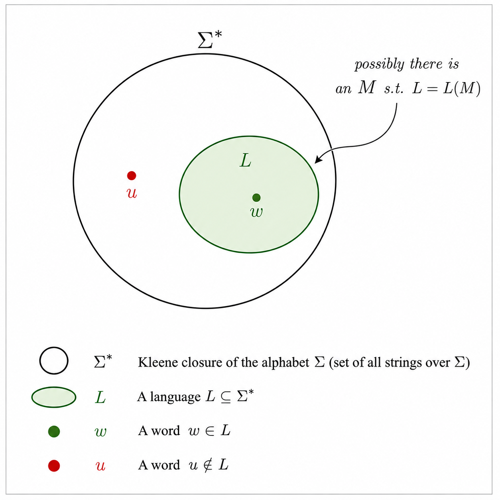

## (WiP) Logic and Computation - Reconciling (Some of) the Very Basic Terminology

### 1. Intro

In this post I am writing down a (hopefully) clarifying note that will help me 
put in place the basic terminology pertaining to computation and logic.

My humble hope is that the process of writing these things down will help me 
put things in the right order once and for all in my mind. 

Also, I have neither hope nor intention of standardizing the terminology in the pertinent 
literature - this is merely a note to self (or to whoever find him/herself
in similar impasse - please be mindful that you are using this note at 
your own risk as I am self-learner in both areas and have no formalized
education in both areas to prop up my case).

In my case the predicament has arisen due to my (unintentional) simultaneous 
reading of two excellent books - cf. [references](#reference): Ullman et 
al. classic(al) *Introduction* 
and Smith's  *Introduction*

Certain sections of these books deal with concepts that are related but, given
different authors and purposes, not easy to reconcile - at least on quick reading.

So what I want to do seems to be an exercise in reverse-engineering of the underlying 
currents of thought that led to the definitions I am interested in. 

One can't help observing here, that although decoding of the great concepts 
is already a challange, the formulation of a great concept such as 
e.g. machine of Turing is many orders of magnitude further on the scale of
difficulty - a compression problems of its own kind, requiring you to 
put intuition into a limited number of words that then give rise to an ocean
of deductions.

Let's cut blabbering short here and get started by taking the computational view.

### 2. The Computational Perspective

To keep length of this text manageable I am assuming that the cornerstone
of the broader story, i.e. definition of *Turing machine* (TM) is given.

First, we will need to define language of a Turing machine:

**Definition (language of a Turing Machine)**
Let $M = (Q, \Sigma, \Gamma, \delta, q_0, F, B)$ be a Turing machine. 
The set of strings $w \in \Sigma^*$ such that $q_0 w \vdash\alpha p \beta$ where
$p \in F$ is called the language of TM $L$ and it is denoted $L(M)$.

Thinking rather abstractly, we have the universe of the string being members
of the Kleene's closure before our eyes now. 

We take a string $w \in \Sigma^*$, feed it into the TM $L$ and let it run. 
When it so happens that the machine enters an accepting state $p \in F$ we 
implicitly assume that it *comfortably* stops operating - i.e. that it halts.

This brings us to the definition of the first, broad kind of TM languages, 
namely:

**Definition (Recursively Enumerable Language)**
Consider a language $L \subset \Sigma^*$. $L$ is called 
*recursively enumerable* iff there exists a TM $L$ such that $L = L(M)$.

The key observation to make here is that RE language definition makes no demands
concerning what happens when $w \in \Sigma*$ that is fed into $M$ 
happens to be such that $w \notin L$.

Clearly, we would like to have some guarantee about what happens 
when we feed $L$ a word $w \notin L$: what if, having started it, we wait 
for a long time? Under RE lang we have no assurance of success - we do not 
want to find ourselves waiting for the proverbial Godot...

This (reasonable) concern is addressed by imposing a requirement on the 
behavior of the TM when we feed into it a word not in $L$. In order
to feel slightly more comfortable we want to know that the machine would stop 
in such scenario - or more precisely: halt. However, we are justified in asking about 
*how* it might halt? Can it halt in any manner? Clearly, one can imagine
a trajectory such that the machine passes through an accepting state when 
processing. Even worse: the danger of it halting in an accepting state is 
looming! Luckily, this would contradiction with the earlier 
definition of the very language we are considering. 

Therefore, the following definition feels natural:

**Definition (Recursive Language)**
Language $L$ is called *recursive* iff there exists a TM $M$ such that:

(1) $ \forall w \in L$: $M$ accepts $w$

(2) $ \forall w \notin L$: $M$ halts, but never enters any accepting state when processing $w$

Brief terminological remark is in order here: I am tacitly using the fact that 
acceptance of a state means that the machine *halts* in that accepting state.

In other words, when dealing with a *recursive* language we have the
certainty that the machine would halt - it is, so to speak, worth our wait in the 
sense that we know it will halt, even if the run will take a lot of time e.g.
the age of Universe.

So the picture that we have before us can be summarized as follows.

We pick an alphabet of input symbols, e.g. $\Sigma = B = \{0, 1\}$.

We cut out a slice $L$ of our (uncountable infinite binary) universe that 
might happend to be a RE lang or a recusive lang.

We then probe a word $w \in \Sigma^*$, e.g. $w=101100101101$, feed it into 
TM $M$ and watch what happens (possibly infinitely long).

This diagram (courtesy of ChatGPT) can be of a little help:

Having looked at the concepts (slightly) more formally, let's try to reconcile
them with the intuitive idea of a decidable problem. 

(Note: I am deliberately NOT discussing here how languages relate to problems
- cf. Ullman for clarification if needed. ).

### 3. The Logical Perspective

We will start by jumping into the definition:

**Definition(Computable Function)**

### 4. Summary

## References
1. J. Ullman, Hopcroft et al., *Introduction to Automate Theory*
2. P. Smith, **

